# FoodMind AI

[](https://github.com/vsokoltsov/foodmind.ai/actions/workflows/ci.yml)

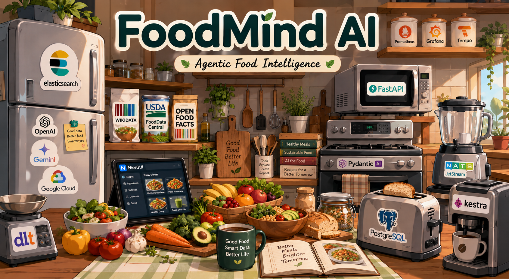


FoodMind AI is an agentic food-intelligence application. It combines food knowledge from Wikidata, USDA FoodData Central, and Open Food Facts with Elasticsearch retrieval and specialist PydanticAI agents. Users can search foods, analyse nutrition, compare products, and receive constraint-aware recommendations in a persistent chat interface.

## 🧩 Problem statement

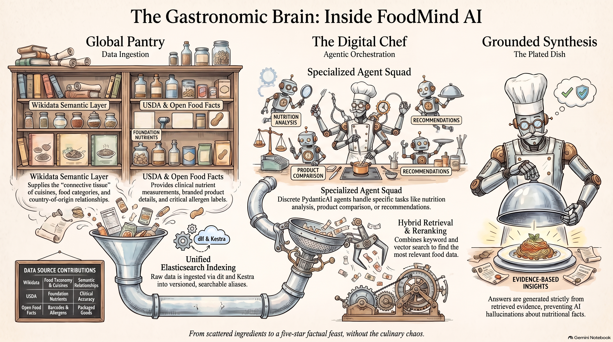

Food data is distributed across sources with different strengths and schemas:

- **Wikidata** supplies semantic food, cuisine, category, and country relationships.
- **USDA FoodData Central** supplies curated foundation-food nutrients and branded-product nutrition.
- **Open Food Facts** supplies product barcodes, ingredients, allergens, labels, and categories.

Looking across these sources manually is difficult. The same question can require search, nutrition extraction, product comparison, safety constraints, and related-entity lookup. FoodMind makes that information searchable and lets an LLM use retrieved evidence rather than answer from unsupported general knowledge.

## 🥕 Data sources

FoodMind ingests four datasets from three source families. Each source is preserved in its own versioned Elasticsearch index and read alias; the `food-entities` alias searches across all of them when a request needs a cross-source catalog.

| Source | Dataset | What it contributes | Elasticsearch alias |
| --- | --- | --- | --- |
| [Wikidata](https://www.wikidata.org/) | Food entities | Canonical entity IDs, labels, descriptions, food taxonomy, cuisines, countries, aliases, and related entities. It provides the semantic layer used for cuisine/category and related-food lookups. | `wikidata-food-entities` |
| [USDA FoodData Central](https://fdc.nal.usda.gov/) | Foundation Foods | Curated, analytically derived foods with detailed nutrient measurements. Best suited to nutrition analysis and comparison of generic foods. | `usda-foundation-foods` |
| [USDA FoodData Central](https://fdc.nal.usda.gov/) | Branded Foods | Packaged branded products with brand names, ingredients, serving data, and label-derived nutrition. | `usda-branded-foods` |
| [Open Food Facts](https://world.openfoodfacts.org/) | Product export | Product barcodes, names, brands, ingredients, allergens, labels, categories, countries, images, and Nutri-Score-style metadata when available. Best suited to product lookup, comparison, and allergen-aware recommendations. | `openfoodfacts-products` |

The source data is intentionally heterogeneous. Missing fields and inconsistent source tags are retained at ingestion time rather than silently invented or discarded. Retrieval, canonical aggregate models, source-specific filters, and agent prompts handle these differences at query time. This preserves provenance and lets answers state which catalog supplied each fact.

## 🎯 Objectives

- Ingest the three source families reproducibly with **dlt** and **Kestra**.
- Publish versioned Elasticsearch indexes safely through alias switching.
- Provide hybrid retrieval: lexical BM25 search, vector search, and document reranking.
- Route a request to the appropriate specialist agent(s), including multi-agent requests.
- Preserve bounded conversation context while keeping long LLM work outside database transactions.
- Stream useful execution progress to the UI through FastAPI SSE and NATS JetStream.
- Evaluate retrieval and LLM output, persist evaluation artifacts, and load the selected retrieval approach at runtime.
- Monitor the API, worker, agents, NATS, feedback, token use, and traces with Prometheus, Grafana, and Tempo.

## 🎨 UI

* [Cloud Run App](https://foodmind-ui-4qpn67rywa-ey.a.run.app/)

> ⚠️ This active URL, and the URLs below, may be temporarily unavailable at the time of review.

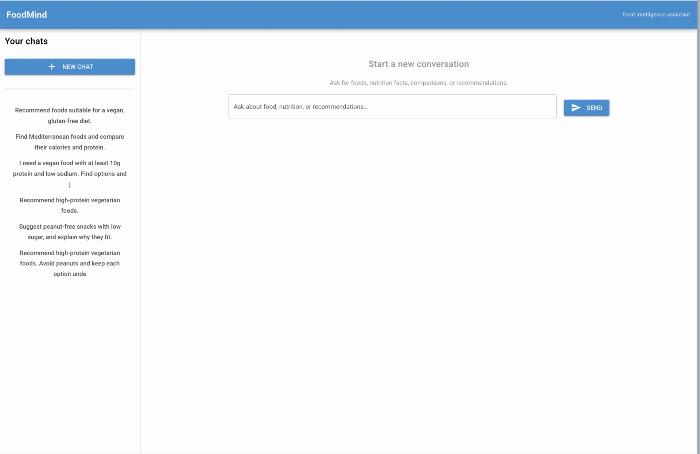

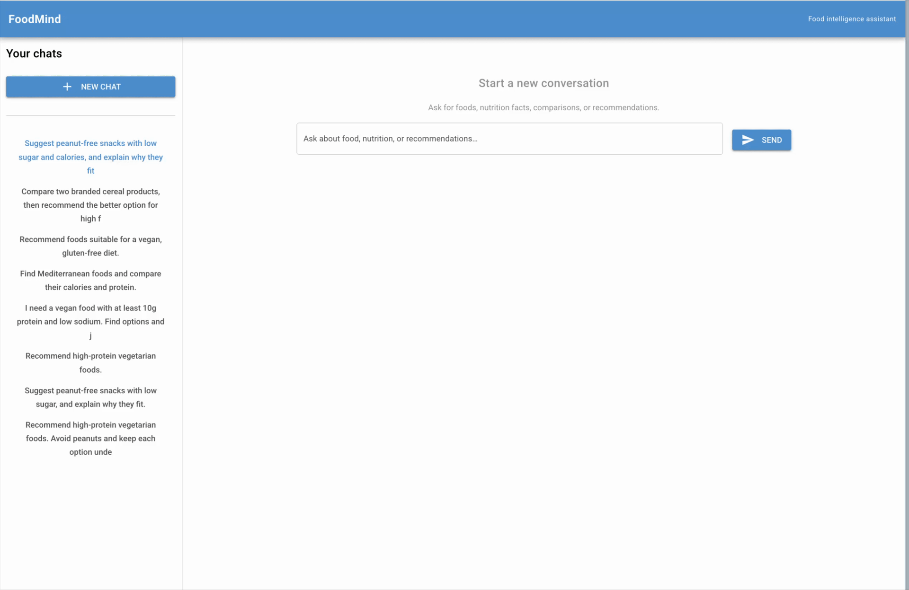


## 🏗️ Architecture

### 🌍 Global

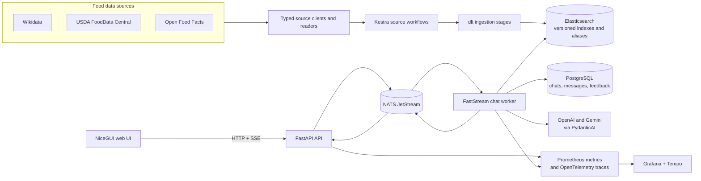

The storage model deliberately separates concerns: Elasticsearch is the food knowledge base, PostgreSQL stores user-facing chat state and feedback, NATS transports asynchronous chat work, and GCS can store ingestion and evaluation artifacts outside local development.

### 🧠 Orchestration

The orchestrator uses a fast direct route for unambiguous requests and a structured planner for requests that require several specialists. Query rewriting runs before routing, retrieval uses the configured evaluated approach, and the executor avoids repeat agent calls within one request.

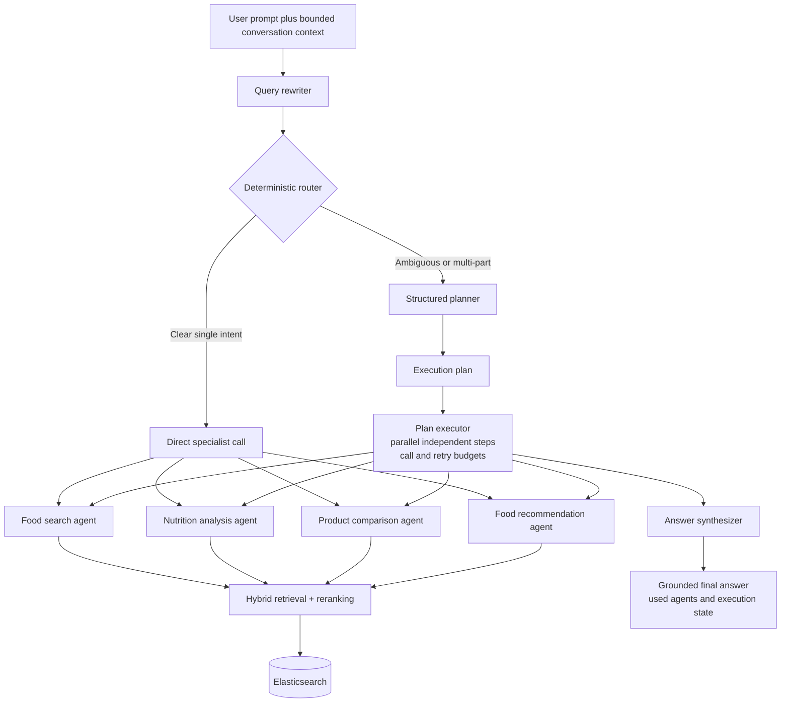

| Component | Responsibility |
| --- | --- |
| **Conversation context builder** | Loads the stored chat summary and recent messages, bounds their size, and combines them with the new message so follow-up requests retain relevant context. |
| **Query rewriter** | Converts conversational wording into a compact retrieval-oriented query while preserving food names, constraints, allergens, cuisines, nutrition targets, and comparison criteria. It has a deterministic fallback. |
| **Router** | Applies low-latency deterministic intent checks. A clearly single-purpose question goes directly to one specialist, avoiding planner and synthesis calls. |
| **Planner** | Uses structured LLM output for ambiguous or multi-part questions. It selects one or more agents and defines their dependent or parallelizable steps. |
| **Plan executor** | Runs independent planned steps concurrently, tracks the execution state, enforces total/per-agent call budgets, caches request-scoped retrieval work, and records retries/errors. |
| **Specialist agents** | Food search, nutrition analysis, product comparison, and food recommendation agents call only their relevant repositories and retrieval tools. |
| **Hybrid retriever and reranker** | Combines lexical BM25 and vector retrieval in Elasticsearch, then reorders candidates using relevance signals. The worker selects the best evaluated retrieval approach when an evaluation artifact is available. |
| **Synthesizer** | Combines only the supplied specialist evidence into a concise final answer for multi-agent requests. Direct single-agent responses do not need this extra model call. |
| **Execution state** | Keeps the original and rewritten query, selected agents, retrieved evidence, completed steps, errors, retry counts, and timing data for one request. It supports observability and prevents accidental repeat work. |

Specialists have distinct tool sets:

- **Food search**: name, ingredient, cuisine, country, brand, category, source, and Wikidata related-entity lookups.
- **Nutrition analysis**: USDA foundation and branded nutrients, comparison, and unit normalization.
- **Product comparison**: barcode/name lookup, nutrients, ingredients, allergens, and ranking criteria.
- **Food recommendation**: candidate retrieval, cuisine/category relationships, nutrition targets, and allergen exclusions.

### 💬 Chat

The browser receives a persistent anonymous `user_id` through NiceGUI’s signed storage cookie. The UI sends a message to the streaming endpoint. The API creates a chat only when the first message is submitted; it does not create empty chats.

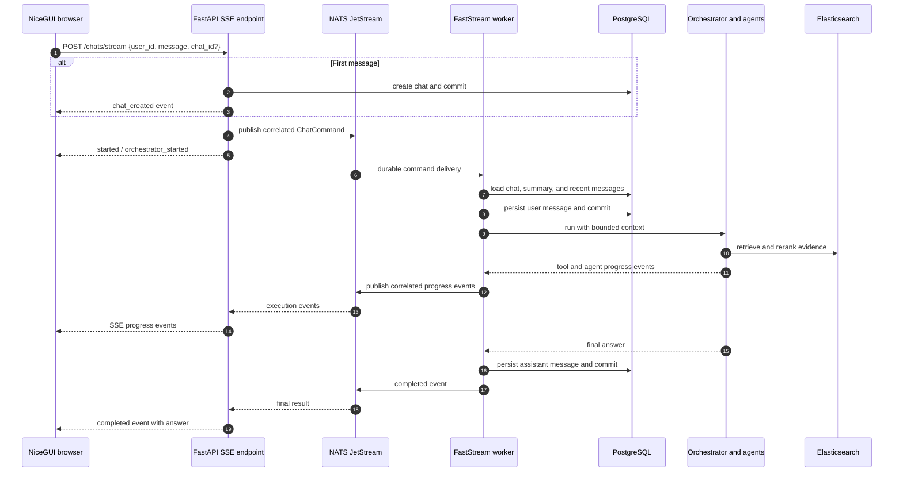

`ConversationContextBuilder` supplies the optional stored summary, the latest eight user/assistant messages (each truncated to 1,500 characters), and the current message. This gives the model conversational continuity without allowing the prompt to grow without bound. Database commits happen before and after long-running agent work, so PostgreSQL does not hold an idle transaction while models or retrieval are running.

## 📊 Dashboards

* [Dashboards UI](http://34.185.159.99:3000/d/foodmind-overview/foodmind-operations)

> ⚠️ The dashboard URL is a live deployment endpoint and may be temporarily unavailable at the time of review.

Grafana is provisioned with a FoodMind operations dashboard generated from Jsonnet at `infra/grafana/dashboards/foodmind-overview.jsonnet`. It groups panels by purpose, including:

- API request rate, in-flight requests, errors, and latency.
- Query rewriting, planning, execution, synthesis, agent, and retrieval-stage latency.
- Per-agent and total LLM token usage.
- NATS command/event throughput, active SSE streams, and chat-worker execution results.
- Feedback volume and useful/not-useful ratio.
- Conversation-context size and message-processing timings.
- OpenTelemetry traces in Tempo, linked from Grafana.

Generate the provisioned dashboard JSON after changing its Jsonnet source:

```bash
make grafana-dashboards
```

Local observability URLs:

- Grafana: <http://localhost:3000>
- Prometheus: <http://localhost:9090>
- Tempo: <http://localhost:3200>

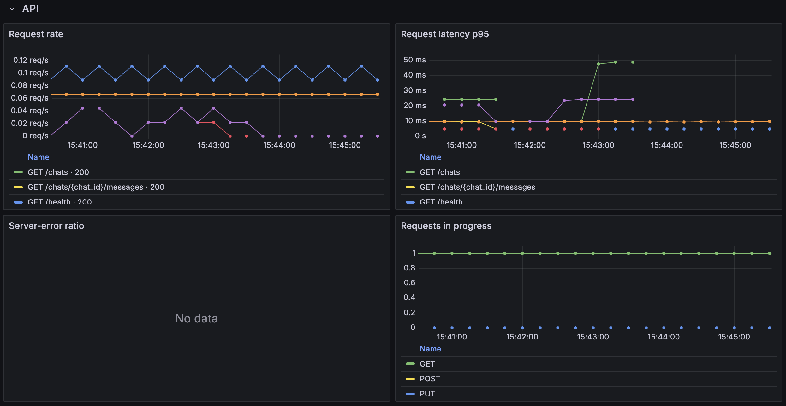

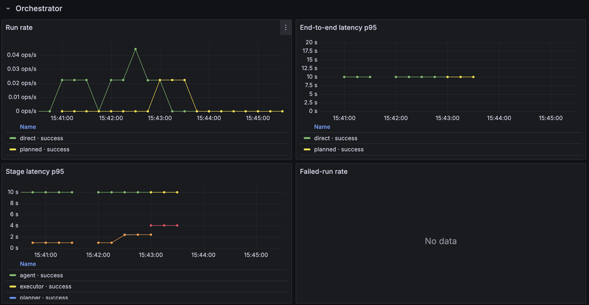

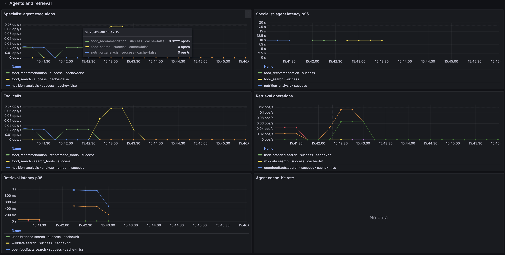

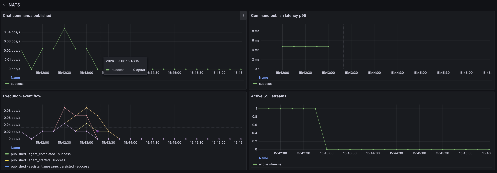

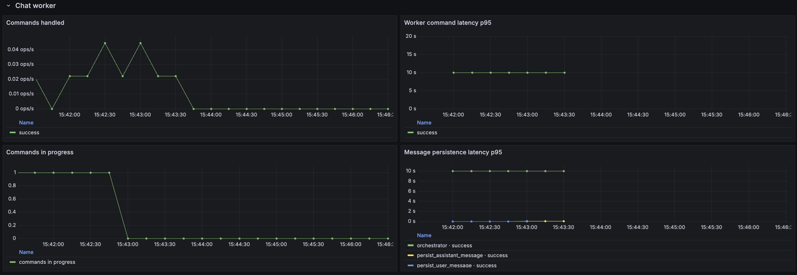

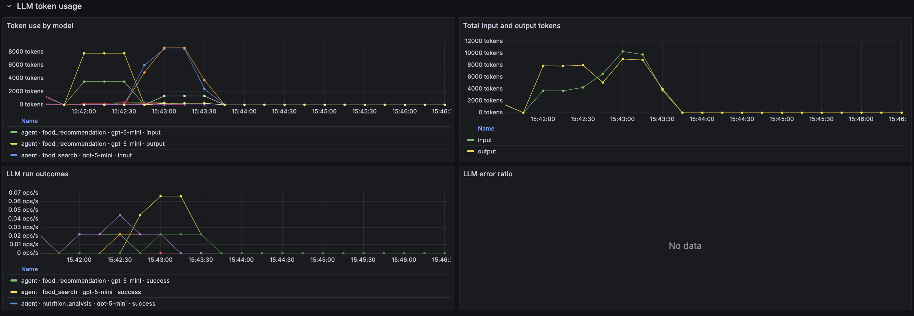

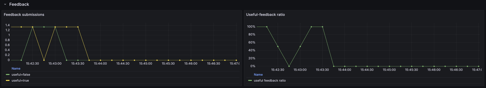

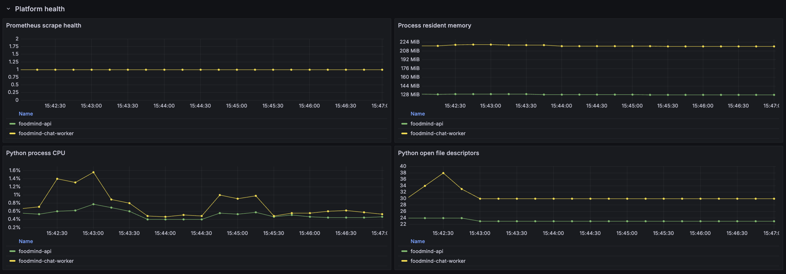

## 🗂️ Project structure

```text
.
├── app/
│   ├── aggregates/        # Canonical business objects shared between layers
│   ├── agents/            # PydanticAI specialists, router, planner, executor, context
│   ├── api/               # FastAPI lifespan, endpoints, middleware, HTTP models
│   ├── clients/           # Typed Wikidata, USDA, and Open Food Facts clients/readers
│   ├── evaluation/        # LLM and retrieval evaluation, artifact persistence
│   ├── ingestion/         # dlt stages, snapshot validation, Elasticsearch publishing
│   ├── messaging/         # NATS JetStream commands and execution events
│   ├── models/            # SQLAlchemy chat and feedback models
│   ├── observability/     # Prometheus metrics and OpenTelemetry tracing
│   ├── repositories/      # Elasticsearch and PostgreSQL data-access layer
│   ├── storage/           # Local/GCS artifact-store protocol and implementations
│   └── ui/                # NiceGUI chat interface
├── alembic/migrations/    # PostgreSQL and Elasticsearch bootstrap migrations
├── cmd/                   # API, worker, ingestion, and dashboard utility entry points
├── elasticsearch/         # Versioned Jsonnet index and alias definitions
├── infra/
│   ├── deployment/        # Terraform-managed Kubernetes and Helm releases
│   ├── grafana/           # Dashboard Jsonnet and Grafana provisioning
│   ├── helm/foodmind/     # Helm chart for GKE deployment
│   ├── kestra/            # Kestra application configuration and source flows
│   ├── prometheus/        # Prometheus scrape configuration
│   ├── tempo/             # Tempo tracing configuration
│   └── terraform/         # Modular GCP and Elastic Cloud infrastructure
├── tests/                 # Unit, integration, agent, API, and evaluation tests
├── docker-compose.yml     # Complete local development stack
├── docker-bake.hcl        # Declarative production container build graph
└── app/models.yaml        # Version-controlled model-role configuration
```

## 📜 API contract

All chat requests require a UUID `user_id`. The UI generates it once and retains it in signed browser storage. API documentation is available locally at <http://localhost:8000/docs>.

| Method | Endpoint | Purpose |
| --- | --- | --- |
| `GET` | `/health` | Check API and Elasticsearch availability. |
| `POST` | `/chats` | Create a chat with its first message and queue it; returns `202 Accepted`. |
| `POST` | `/chats/stream` | Create a chat when needed, submit a message, and stream execution events as SSE. |
| `GET` | `/chats?user_id={uuid}` | List a user’s chats by latest activity. |
| `GET` | `/chats/{chat_id}?user_id={uuid}` | Read one chat. |
| `DELETE` | `/chats/{chat_id}?user_id={uuid}` | Delete a chat and its messages. |
| `GET` | `/chats/{chat_id}/messages?user_id={uuid}` | Read chronological chat history and associated feedback. |
| `PUT` | `/chats/{chat_id}/messages/{message_id}/feedback` | Create or replace useful/not-useful feedback for an assistant answer. |

Example streamed request:

```bash
curl --no-buffer http://localhost:8000/chats/stream \
  --header 'Content-Type: application/json' \
  --data '{
    "user_id": "00000000-0000-4000-8000-000000000001",
    "message": "Compare protein and fiber in chickpeas and lentils"
  }'
```

The stream emits lifecycle events such as `started`, `chat_created`, `query_rewritten`, `agent_started`, `tool_started`, `agent_completed`, `completed`, and `error`. The final `completed` event contains the answer, persisted assistant-message ID, used agents, completed steps, errors, and per-step durations.

## 🚀 Setup

### 📋 Prerequisites

- Docker Compose
- [uv](https://docs.astral.sh/uv/)
- An OpenAI API key and Google Cloud Application Default Credentials for the default model configuration
- Optional: `jsonnet` for generating Grafana and Elasticsearch artifacts (`brew install jsonnet` on macOS)

### 💻 Run locally

1. Create your local configuration and provide the required model credentials:

   ```bash
   cp .env.sample .env
   ```

   The default `app/models.yaml` uses Vertex AI for query rewriting, planning, synthesis, and embeddings, and OpenAI for specialist agents and the evaluation judge. Set `OPENAI_API_KEY` and point `GOOGLE_APPLICATION_CREDENTIALS` at a Google service-account JSON key with Vertex AI access. The Compose stack mounts `./gcp.json` at that path, so place the key at `gcp.json` in the repository root (it must not be committed).

   Alternatively, change the provider/model roles in `app/models.yaml` or override nested settings such as `MODELS__PLANNER__PROVIDER=gemini` and set `GEMINI_API_KEY`.

2. Install Python dependencies:

   ```bash
   uv sync --dev
   ```

3. Start the complete stack:

   ```bash
   docker compose up --build
   ```

   `run-migrations` waits for PostgreSQL and Elasticsearch, applies Alembic migrations, creates missing Elasticsearch bootstrap indexes/aliases, and then allows dependent services to start. Kestra imports the flows in `infra/kestra/flows/` through the one-shot `kestra-init` service.

4. Open the local services:

   - FoodMind UI: <http://localhost:7860>
   - FastAPI Swagger: <http://localhost:8000/docs>
   - Kibana: <http://localhost:5601>
   - Kestra: <http://localhost:8080>
   - NATS UI: <http://localhost:31311>
   - Grafana: <http://localhost:3000>
   - Prometheus: <http://localhost:9090>

   Kestra now uses its native login directly. The default local credentials are
   `admin@foodmind.local` / `Foodmind123`; override both `KESTRA_BASIC_AUTH_*`
   variables in `.env` outside local development.

### 🐳 Build production images locally

The image build graph is declared in `docker-bake.hcl`. Build the shared Python
base first, then the application images:

```bash
docker buildx bake -f docker-bake.hcl --load python-dependencies
docker buildx bake -f docker-bake.hcl --load images
```

CI supplies the Artifact Registry prefix, immutable tags, remote Python base,
GitHub Actions caches, and `--push` behavior through `docker/bake-action`.

### 📥 Ingest data

* [Kestra UI](http://35.242.218.76:8080/ui/main/flows)

> ⚠️ The ingestion UI is a live deployment endpoint and may be temporarily unavailable at the time of review.

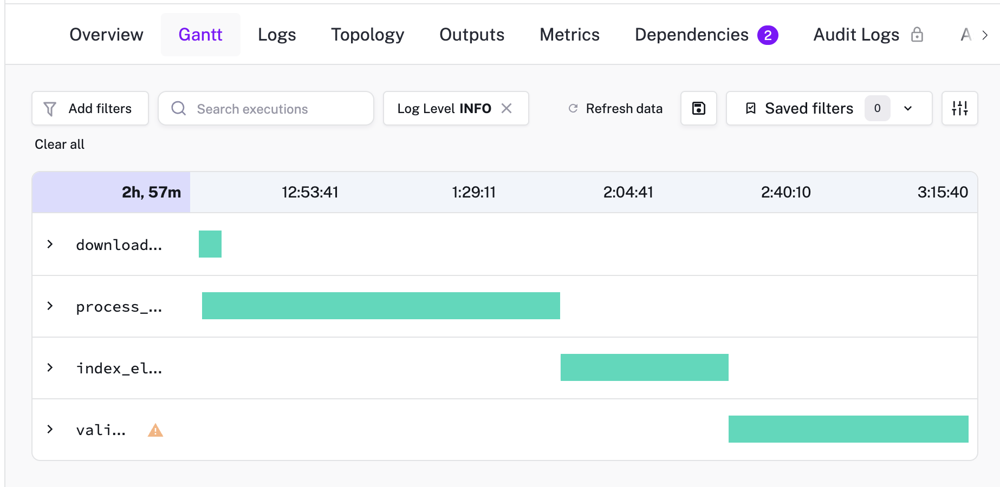

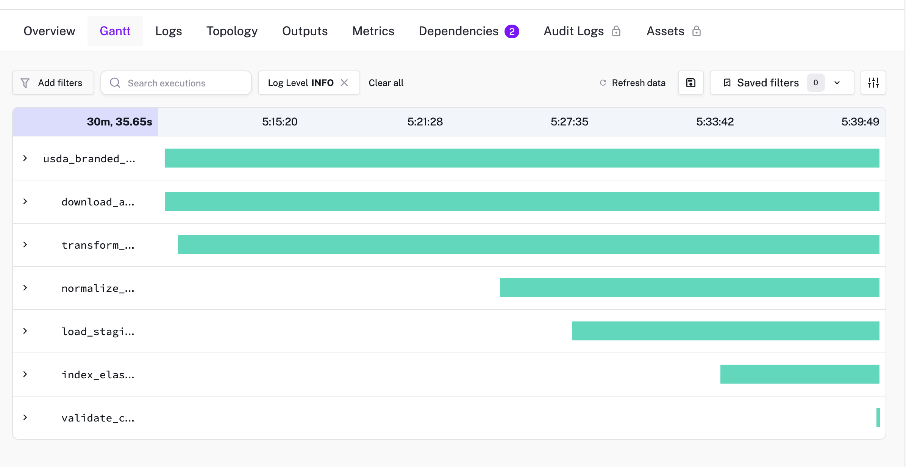

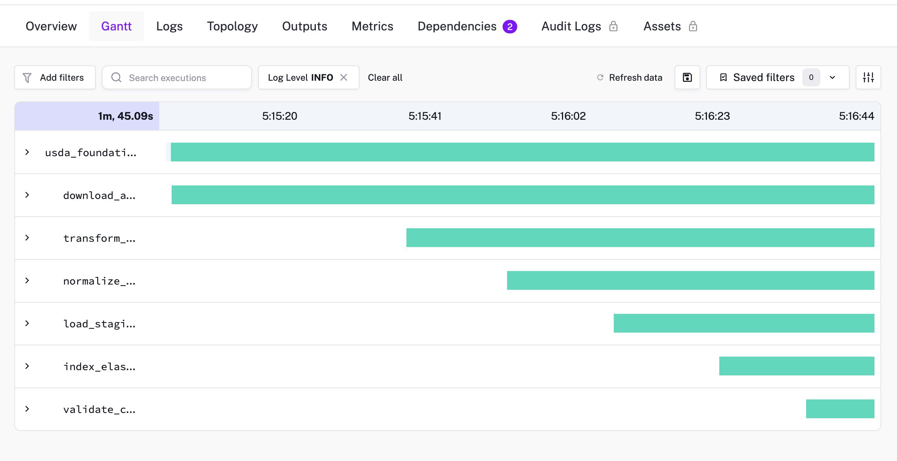

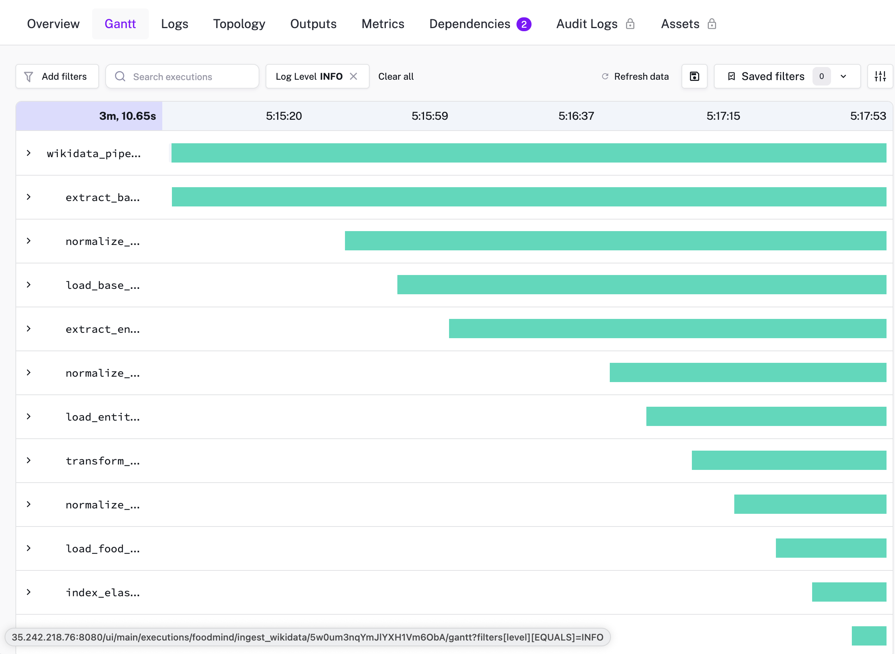

The Kestra parent flow `foodmind.foodmind_ingestion` starts the Wikidata, USDA Foundation, USDA Branded, and Open Food Facts source flows in parallel. Each flow exposes discrete download, transformation, dlt normalization/staging, Elasticsearch publishing, and validation tasks.

For a command-line run instead:

```bash
uv run python cmd/ingestion.py --show-progress
```

Archive readers stream large USDA and Open Food Facts datasets in bounded batches. Reuse downloaded archives by default; pass `--force-download` only when you intentionally want to replace them. After a successful validation, the source alias switches atomically to the newly published Elasticsearch snapshot. A failed load leaves the existing read alias intact.

### ✅ Quality checks and evaluation

```bash
make lint
make typecheck
make test-unit
make test-integration
make evaluation
```

Individual agent and retrieval evaluation targets are also available in the `Makefile`. Evaluation artifacts can be persisted in GCS and loaded by the worker to select the best evaluated retrieval approach.

### 🧹 Local reset

To remove all local service data, including PostgreSQL chats, NATS streams, and Elasticsearch indexes:

```bash
docker compose down --volumes
```

This is destructive to local data only.
